## Touching Grass
- [Climbing](#Climbing)
- [Slacklining](#Slacklining)
- [Snowboarding](#Snowboarding)
- [Biking](#Biking)
- [Music](#Music)

### Climbing
I broke the tension cable in my wrist in June of 2023, it has recently healed, I am now getting back into shape to climb again.
My home gym is the rock wall at Wooden.

#### Buildering at UCLA
Over the past two years I've learned that UCLA has a long history of buildering. There used to be a page on Mountain Project which was sadly removed as well as all the old images. Thankfully, I had a cached version on my phone, some of the climbs were able to be recovered. Those images as well as images I've taken and images from the blog [Excess Vertical](excessvertical.blogspot.com/2012/12/ucla-campus-buildering.html) are below.

The recovered Mountain Project images are of the late Peter Hayes, a student and professor in the biology department at UCLA.

##### Ackerman Union, The Wall (5.10)
This climb still exists

    <a>
        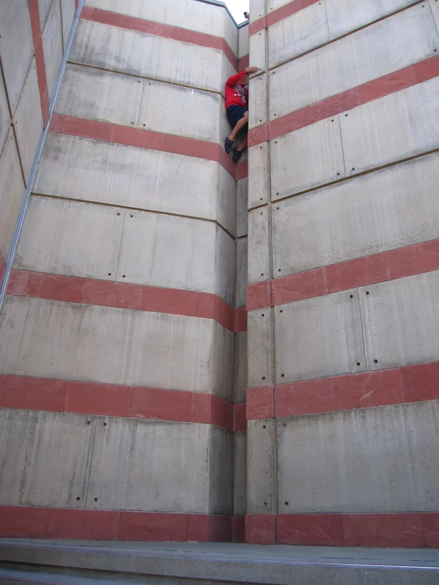
    </a>

 

    

 

    

 

    <a>
        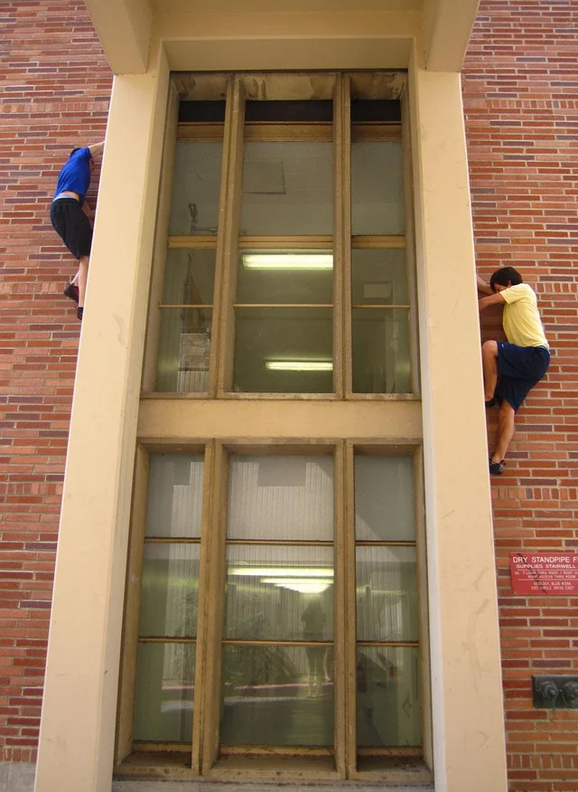
    </a>

 

    <a>
        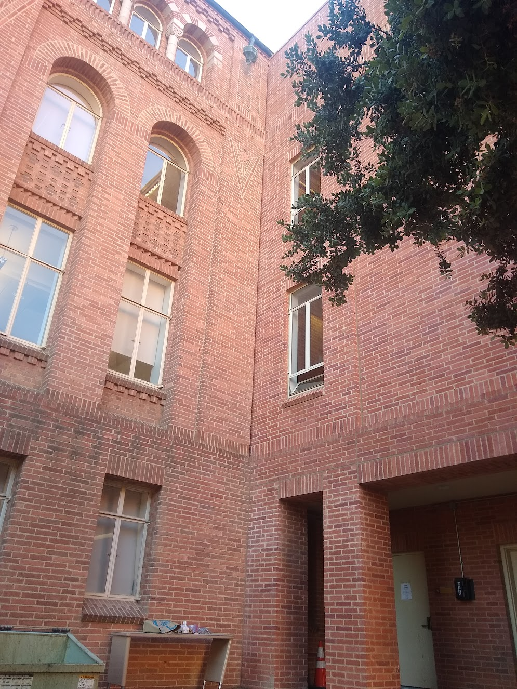
    </a>

 

    <a>
        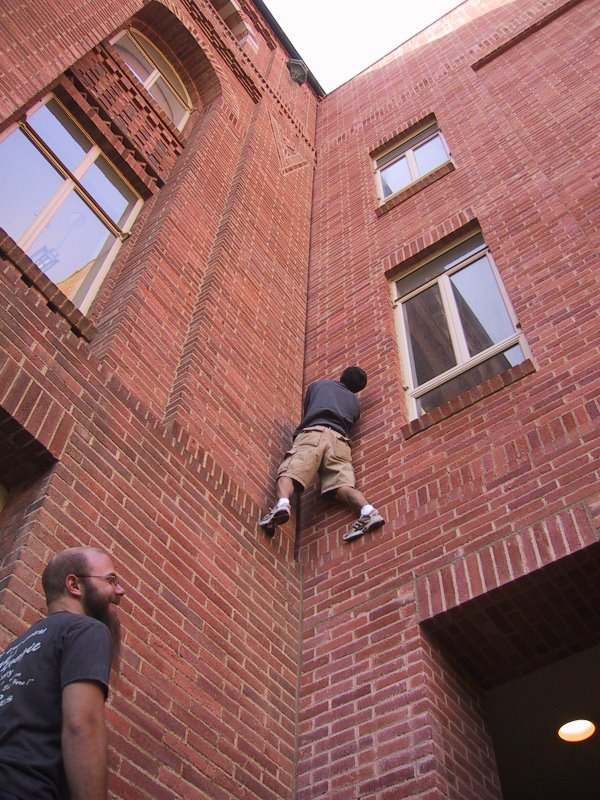
    </a>

 

    <a>
        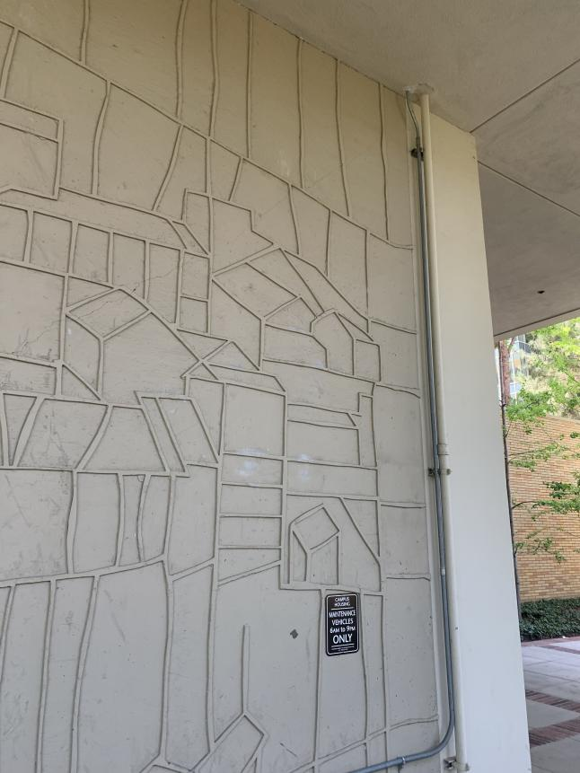
    </a>

 

    <a>
        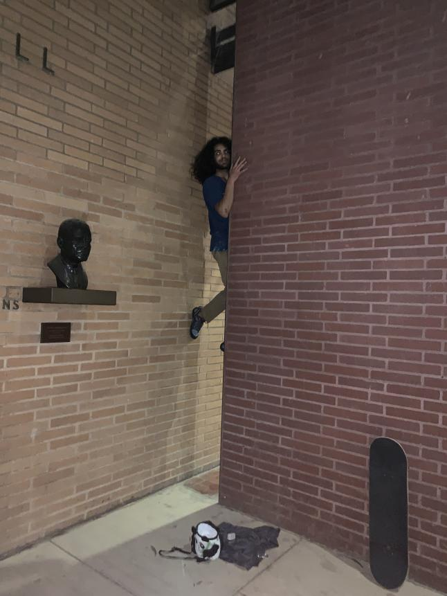
    </a>

 

    

 

    

 

    <a>
        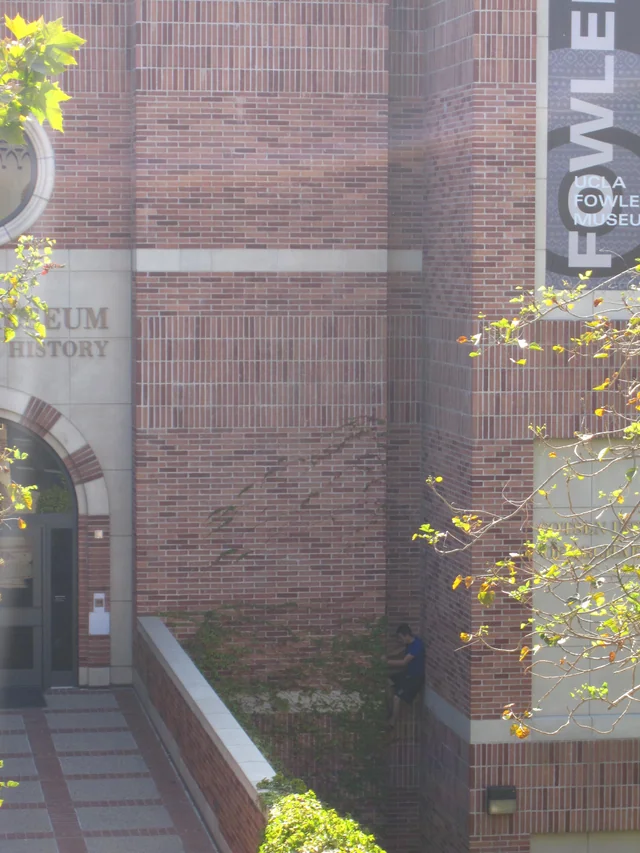
    </a>

 

    <a>
        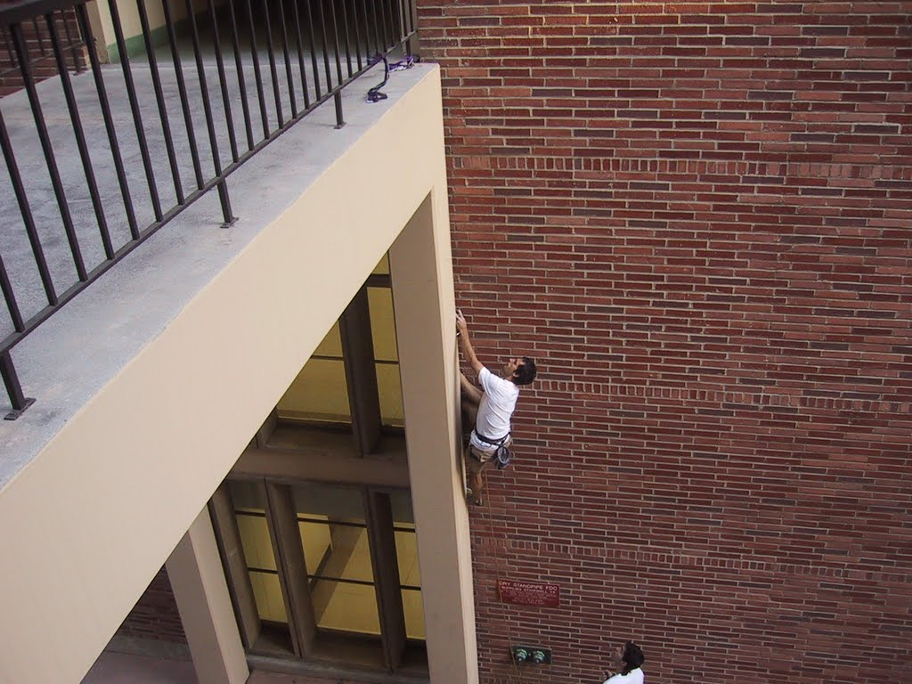
    </a>

 

    <a>
        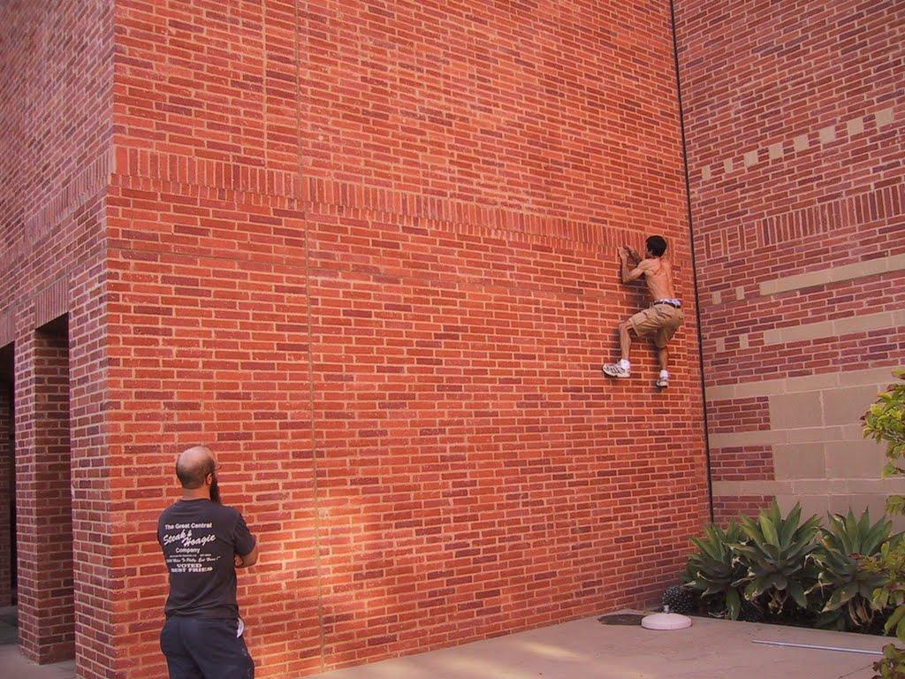
    </a>

 

    <a>
        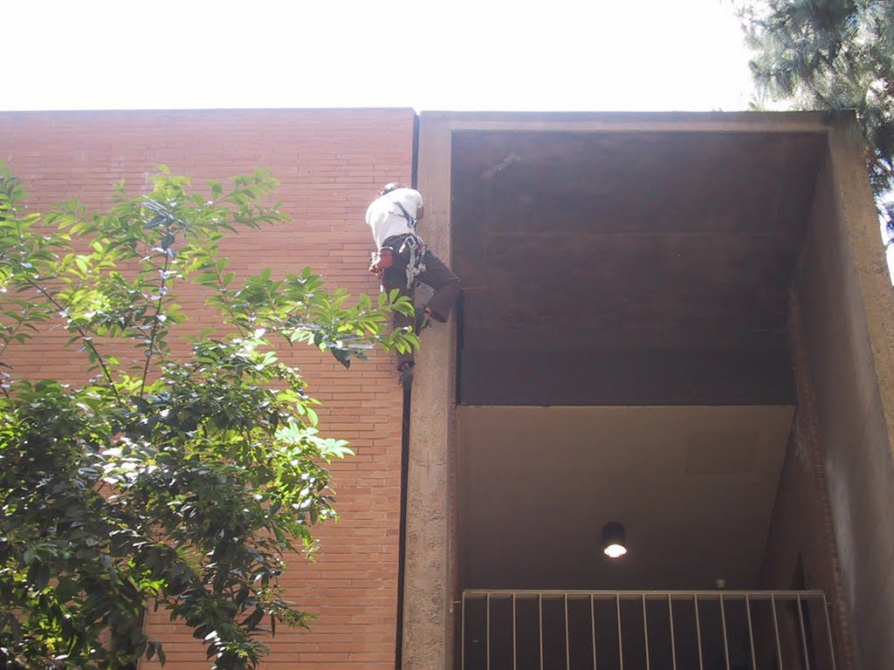
    </a>

 

    <a>
        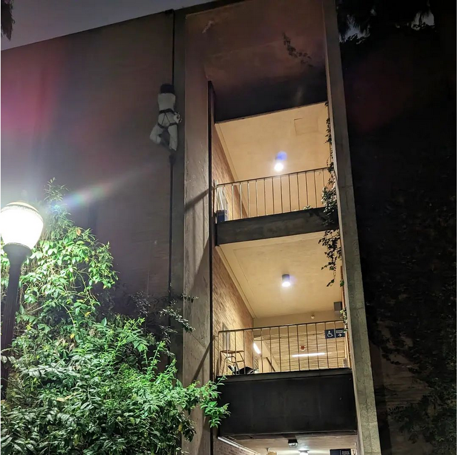
    </a>

 

    <a>
        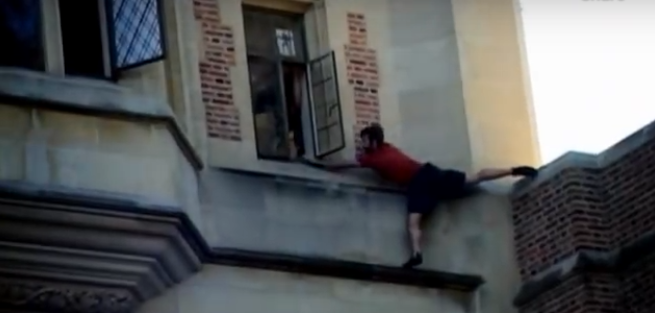
    </a>

 

### Slacklining
I have recently switched to using 100m of 1" BC Blue with a primitave tension setup.
My current goal is 30m [Chongo](http://www.chongonation.com/) sit start.

    <a>
        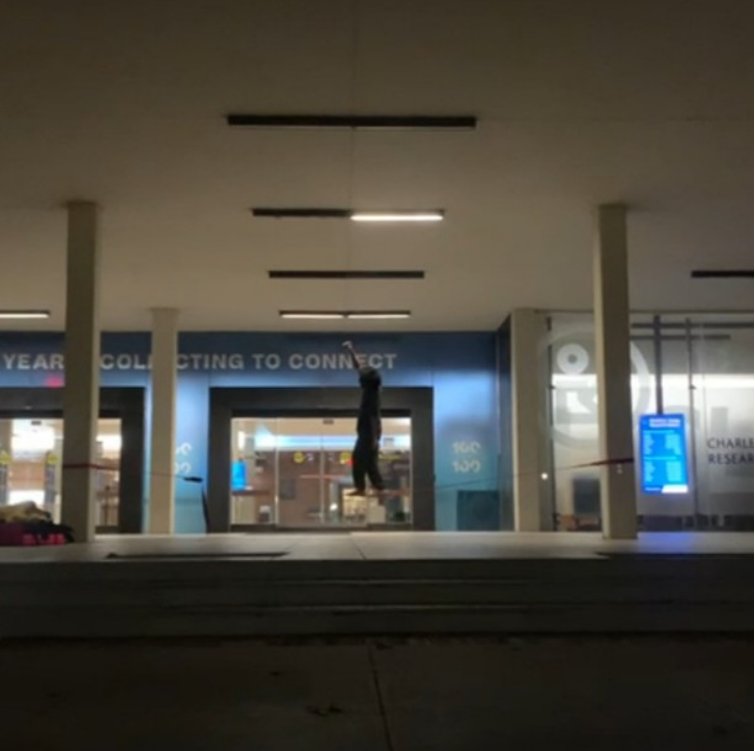
    </a>

 

### Snowboarding
Yep, it's pretty fun.

### Biking
I have a bike. I like to bike when I can't climb. My current goal is to improve my 20 mile time. Maybe I'll get Strava in the future.

### Music
I play the piano and I'm modifying a Nektar GX61 into a keytar; I'll post the files here when I'm done.

Once a month I make a collaborative Spotify playlist and try to invite as many people to add whatever they're listening to that month.
#### 2021
- [August 2021](https://open.spotify.com/playlist/61X1FJYGIJ9BGE7FELHrad?si=15f2473afdb446b2)
- [September 2021](https://open.spotify.com/playlist/0tJlkLMq66Y7lUwsccd8Yb?si=2507b96697ab4cdd)
- [October 2021](https://open.spotify.com/playlist/12vEEdoceptEomSndSqyBV?si=45f74912f5a74aa5)
- [November 2021](https://open.spotify.com/playlist/2xMuvlok1UcbtGWl4bmtsR?si=ad6a3e9b1ca84757)
- [December 2021](https://open.spotify.com/playlist/7hzYOzgjFvRybattd3XIaM?si=f396c046d6ca4337)

#### 2022
- [January 2022](https://open.spotify.com/playlist/4LMl4GzcgVra5YA01TqFj3?si=8309cbfccd074ae0)
- [February 2022](https://open.spotify.com/playlist/6pbJO23qL9MQRaTawrM0pU?si=f301e8bf612e4b0c)
- [March 2022](https://open.spotify.com/playlist/1AFcGSnEwqLerlmrBoh9Hj?si=15f359bf06414312)
- [April 2022](https://open.spotify.com/playlist/7ac30QsnjYNRQm3wm7XCcj?si=84da7aced6fc471c)
- [May 2022](https://open.spotify.com/playlist/7ctuLbLwqjWiutH0ngEwhF?si=5bdc36f9d1bf485f)
- [June 2022](https://open.spotify.com/playlist/5nk080PRLbIMU9nXpSFNrE?si=af47f7c01d2b4df9)
- [July 2022](https://open.spotify.com/playlist/463NgJNg7JjroKygpr43fj?si=4361088471d148da)
- [August 2022](https://open.spotify.com/playlist/0v2eJgTmuq8FvUcv7ln3yw?si=18bce77db9284b0f)
- [September 2022](https://open.spotify.com/playlist/4j8yBctqnEajD6k5uV9OjK?si=5016d5e5a0cb4c3c)
- [October 2022](https://open.spotify.com/playlist/6IAGfo9S9YneT88wizdqSj?si=c485e519a11c4ddd)
- [November 2022](https://open.spotify.com/playlist/0UfWcKmWaQsj91QiZS11Ut?si=8edf78e2a11943ba)
- [December 2022](https://open.spotify.com/playlist/7AOpISmGo7jzlXtvquQUZ3?si=9d220008dec9491f)

#### 2023
- [January 2023](https://open.spotify.com/playlist/40WspkytQTrCdUYcjXnlSd?si=3e998c93a5b44d5b)
- [February 2023](https://open.spotify.com/playlist/7kH0UqvLAPFcwW4TXrUFGv?si=c31fb5ac3c554303)
- [March 2023](https://open.spotify.com/playlist/5UjY6gtVq0zoE50bj9Zwbf?si=78c66b1e7b954dba)
- [April 2023](https://open.spotify.com/playlist/5iEGLEidFctQFWeXmT5XPs?si=439e97f4256c4566)
- [May 2023](https://open.spotify.com/playlist/2XoVemPcUouOMMaDYkUamj?si=22202b51ab2c4655)
- [June 2023](https://open.spotify.com/playlist/7M2aAeIqtPgRmFiJLKnRdb?si=bd6b1022f0d44a68)
- [July 2023](https://open.spotify.com/playlist/65cHXMsdGiHllDfmkC8eEI?si=dbc4bca8d06740de)
- [August 2023](https://open.spotify.com/playlist/1rbFLBTDJoJY27FrGTp5On?si=9e791925c18a49f9)
- [September 2023](https://open.spotify.com/playlist/2kSmSWuG7SI4OfS9dQKWrx?si=4dd03b1f63fd46ff)
- [October 2023](https://open.spotify.com/playlist/7mUhKoJbBWj6KtrwQS79y2?si=1cf48c02f8f24c83)
- [November 2023](https://open.spotify.com/playlist/7uKvCV4A79Xk1ImkN7r57U?si=cba1bf2b521c45c6)
- [December 2023](https://open.spotify.com/playlist/7zYLTyu6zxO5KM4huL3pLm?si=56ac993070254438)

#### 2024
- [January 2024](https://open.spotify.com/playlist/2M0jt6lSzlCYbgTIEuMllP?si=37273854bfb74e17)
- [February 2024](https://open.spotify.com/playlist/7G8BtpfBDe6QAlPQtidkMp?si=82eb265251bb4cd1)
